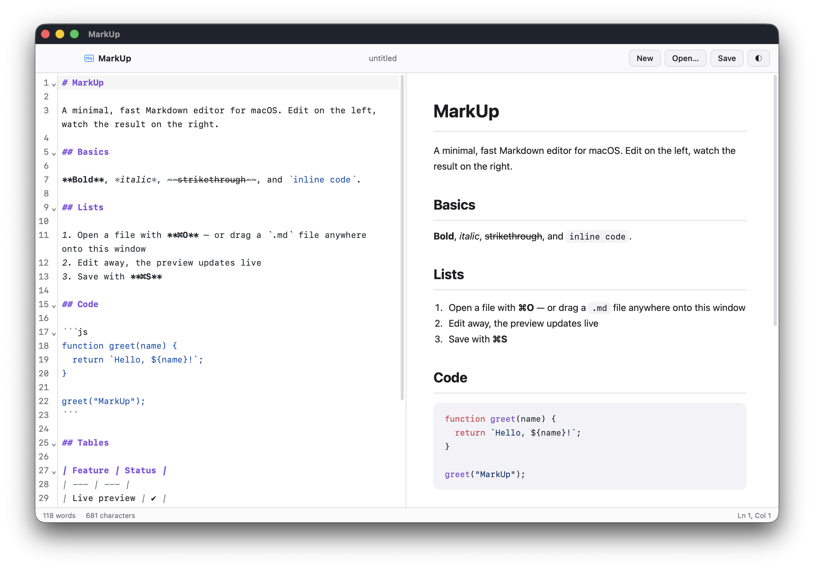
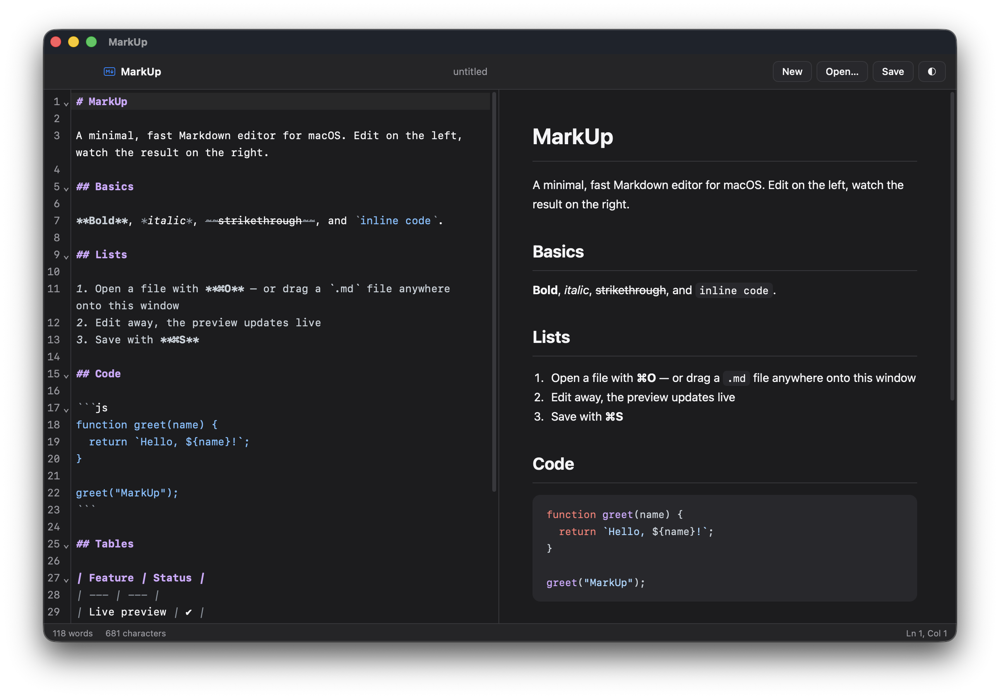

# MarkUp

A minimal, fast **Markdown editor with live visualizer** for macOS, Windows, and Linux. Edit on the left, watch the rendered document on the right — local files, no cloud, no accounts, no bloat.

Built with [Tauri 2](https://tauri.app), [CodeMirror 6](https://codemirror.net), and [remarkable](https://github.com/jonschlinkert/remarkable).

<table>
  <tr>
    <td width="50%" align="center"></td>
    <td width="50%" align="center"></td>
  </tr>
</table>

> **Why?** Importing Markdown into Apple Notes is cumbersome, and many existing macOS editors (e.g. MacDown) are Intel-only and require Rosetta on Apple Silicon. MarkUp builds natively for Apple Silicon, with Windows x64 and Linux x64 built by GitHub Actions and published as tagged releases.

## Features

- **Split view** — source editor and rendered preview side by side, with a draggable divider
- **Full-window preview** — one click hides the source editor for a distraction-free, window-filling view of the rendered document; the splitter and divider return exactly where you left them when toggled off
- **Live preview** — the rendered document updates as you type (100 ms debounce)
- **Full GFM Markdown** — tables, strikethrough, task lists, autolinks, and nested lists via remarkable
- **Code highlighting** — fenced code blocks in the preview highlighted by [highlight.js](https://highlightjs.org) (~190 languages); the editor itself has Markdown syntax highlighting with a GitHub-style palette
- **File handling** — open/save dialogs (`.md`, `.markdown`, `.mdown`, `.txt`), plus drag & drop a file onto the window to open it
- **Open from Finder** — registered as the editor for `.md`, `.markdown`, and `.mdown` files: double-click a document to open it in MarkUp (works on launch *and* when MarkUp is already running)
- **Unsaved-changes guard** — dirty indicator dot and confirmation before discarding edits
- **Light/dark themes** — follows the system appearance on launch, with a manual toggle in the toolbar
- **Status bar** — live word count, character count, and cursor position (`Ln / Col`)
- **Small and native-feeling** — transparent title bar, native traffic lights, no web UI chrome

## Specifications

### Architecture

| Layer | Technology |
| --- | --- |
| Desktop shell | [Tauri 2](https://tauri.app) (Rust) — system WebView only, no bundled Chromium |
| Frontend | Vanilla JavaScript (ES modules), no framework, bundled by [Vite 6](https://vitejs.dev) |
| Editor | [CodeMirror 6](https://codemirror.net) with `@codemirror/lang-markdown` |
| Markdown engine | [remarkable](https://github.com/jonschlinkert/remarkable) 2.x |
| Code highlighting | [highlight.js](https://highlightjs.org) 11.x |
| System integration | `tauri-plugin-fs` + `tauri-plugin-dialog` (v2) |
| CI / Release | GitHub Actions (`release.yml`) — builds macOS (aarch64), Windows (x64), and Linux (x64) and publishes a tagged release |

### Markdown engine configuration

| Option | Value | Notes |
| --- | --- | --- |
| `html` | `true` | Raw inline HTML passes through |
| `gfm` | `true` | GitHub Flavored Markdown: tables, strikethrough, task lists, autolinks |
| `breaks` | `false` | Standard CommonMark line-break rules |
| `langPrefix` | `hljs language-` | Feeds fenced code to highlight.js |
| `highlight` | highlight.js callback | Silently skips unknown languages |

### Editor (CodeMirror 6)

- Markdown language mode with syntax highlighting (custom light/dark `HighlightStyle`s)
- Line numbers, active-line highlight, soft line wrapping
- Autocompletion, bracket matching, undo/redo history, code folding

### UI & window

| Element | Behavior |
| --- | --- |
| Title bar | `titleBarStyle: Transparent` — native traffic lights, toolbar acts as the drag region |
| Window | 1180 × 760 default, 760 × 480 minimum |
| Panes | Resizable via pointer-drag divider, clamped to 20–80 % editor width |
| Toolbar | New / Open… / Save / full-window preview / theme toggle buttons; shows current file name |
| Theme | `prefers-color-scheme` on launch; `◐` button toggles light/dark live |
| Window title | Mirrors the open file's name |

### Status bar

| Field | Detail |
| --- | --- |
| Word count | Whitespace-delimited token count of the document |
| Character count | Raw UTF-16 length of the document |
| Cursor | `Ln <line>, Col <column>` of the main selection head |
| Dirty dot | Bullet next to the file name while unsaved changes exist |

### File I/O

- **Open dialog filters:** `md`, `markdown`, `mdown`, `txt` (+ all files)
- **Save dialog:** defaults to `untitled.md`, `md` filter
- **Drag & drop:** opens dropped files in place (path-based on macOS/Windows; text fallback in the webview)
- **Guards:** dirty state blocks New/Open via confirm dialog and blocks window unload
- **Associations:** `bundle.fileAssociations` declares `.md` / `.markdown` / `.mdown` with role *Editor* (→ `CFBundleDocumentTypes` on macOS, file-type registrations on Windows, MIME in the `.desktop` entry on Linux). The path is forwarded to the frontend per platform — `RunEvent::Opened` on macOS, the launch argument on Windows/Linux — and queued in Rust (so cold-launch opens aren't lost) before being loaded on startup and live. `tauri-plugin-single-instance` keeps MarkUp to one instance, forwarding the file from a re-launch (Windows/Linux) to the running instance
- **Setting as default (macOS):** right-click any `.md` → *Get Info* → *Open with* → **MarkUp** → *Change All…* — or double-click once and confirm the picker

### Keyboard shortcuts

| Action | macOS | Windows |
| --- | --- | --- |
| New document | `⌘N` | `Ctrl+N` |
| Open file | `⌘O` | `Ctrl+O` |
| Save file | `⌘S` | `Ctrl+S` |
| Full-window preview | `⌘E` | `Ctrl+E` |

### Platform support

| Platform | Requirement | Notes |
| --- | --- | --- |
| macOS | 10.15+ | Native Apple Silicon build; x86_64 build also possible via `--target x86_64-apple-darwin` |
| Windows | 10 / 11 x64 | Requires WebView2 runtime (preinstalled on Win 11); NSIS + MSI installers |
| Linux | x64 (glibc) | Requires WebKitGTK 4.1 + GTK3 runtime; `.deb`, `.rpm` (Arch: `webkit2gtk`) |

### Release profile (Rust)

`opt-level = "s"` (small binaries), `lto = true`, `codegen-units = 1`, `panic = "abort"`, `strip = true`.

### Security model

- Access is declared up front through the [Tauri v2 capability system](https://tauri.app/develop/capabilities/) in `src-tauri/capabilities/default.json` — no runtime permission prompts.
- Granted: `core:default`, `dialog:default`, and fs text/binary read + write with full-disk scope. The native file dialogs are the user-facing gate; the app has **no network commands**.
- CSP is `null` while in development; tighten before shipping a public build.

## Repository structure

```
MarkUp/
├── .github/
│   └── workflows/
│       └── release.yml            # CI: macOS aarch64 + Windows x64 + Linux x64 → tagged release
├── docs/
│   └── screenshots/               # README screenshots (light & dark mode)
├── icon-source.png                # Master 1024×1024 app icon
├── scripts/
│   └── gen-icon.mjs               # Generates all platform icons from the master
├── index.html                     # App shell: toolbar, panes, status bar
├── src/
│   ├── main.js                    # Editor setup, remarkable rendering, file I/O, UI wiring
│   └── styles.css                 # Light/dark themes, layout
├── src-tauri/
│   ├── src/
│   │   └── main.rs                # Tauri builder + fs/dialog plugins
│   ├── capabilities/
│   │   └── default.json           # ACL: core, dialog, fs scope
│   ├── gen/                       # ACL schemas generated at build time
│   ├── icons/                     # Platform icons (.icns, .ico, .png)
│   ├── build.rs
│   ├── Cargo.toml
│   └── tauri.conf.json            # Window, bundling, build config
├── vite.config.js
├── package.json
└── LICENSE                        # MIT
```

## Development

### Prerequisites

- **Node.js** 18+ and npm
- **Rust** (stable, via [rustup](https://rustup.rs))
- Platform prerequisites per Tauri:
  - macOS: Xcode command line tools (`xcode-select --install`)
  - Windows: Microsoft C++ Build Tools and the WebView2 runtime
  - Linux: WebKitGTK 4.1 dev packages (e.g. `libwebkit2gtk-4.1-dev`, `librsvg2-dev`, `libayatana-appindicator3-dev`)

### Run in development

```sh
git clone https://github.com/DexterLagan/MarkUp.git
cd MarkUp
npm install
npm run tauri dev
```

### Build release binaries

**macOS (local, Apple Silicon by default):**

```sh
npm run tauri build
# -> src-tauri/target/release/bundle/dmg/MarkUp_<ver>_aarch64.dmg
# -> src-tauri/target/release/bundle/macos/MarkUp.app
```

**Windows x64 / Linux x64 (local):**

```sh
# On the target OS (WebKitGTK deps required on Linux)
npm ci
npm run tauri build
# -> src-tauri/target/release/bundle/{nsis,msi,deb,rpm}/
```

### Cutting a release

Releases are fully automated by the [`release.yml`](.github/workflows/release.yml) workflow (triggered on `v*` tags, or manually from the **Actions** tab):

1. Bump the version in `package.json`, `src-tauri/tauri.conf.json`, and `src-tauri/Cargo.toml`.
2. Commit and push a tag: `git tag vX.Y.Z && git push origin vX.Y.Z`.
3. The workflow builds all three platforms in parallel (macOS aarch64 on `macos-latest`, Windows x64 on `windows-latest`, Linux x64 on `ubuntu-latest`) and publishes a GitHub Release with the DMG, NSIS + MSI, and deb + rpm installers.

Current release: [v1.0.1](https://github.com/DexterLagan/MarkUp/releases/tag/v1.0.1) — DMG (Apple Silicon), NSIS + MSI (Windows x64), deb + rpm (Linux x64).

## Roadmap ideas

- Autosave and multiple open tabs
- Export to HTML/PDF
- Code signing for macOS (Developer ID) and Windows (EV/Code Sign cert) to silence Gatekeeper/SmartScreen

## License

MarkUp is licensed under the **MIT License** — see [LICENSE](LICENSE).

Copyright (c) 2026 Dexter Santucci
